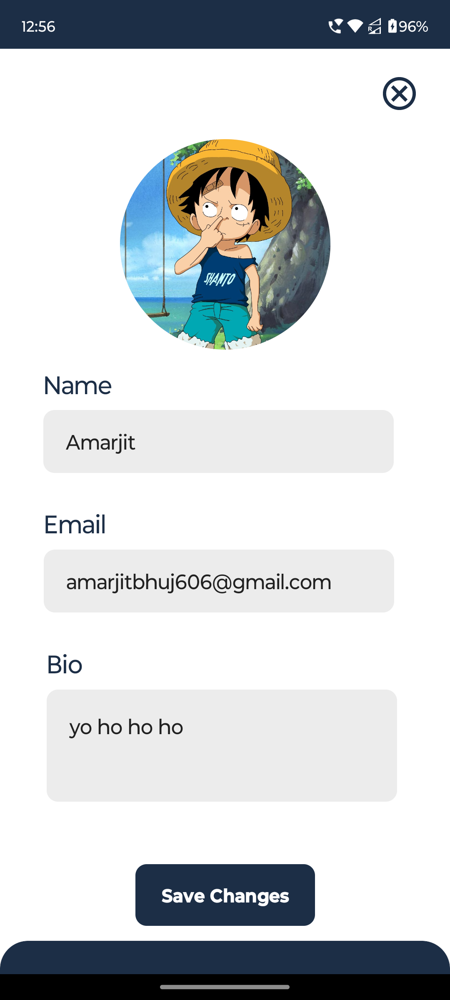
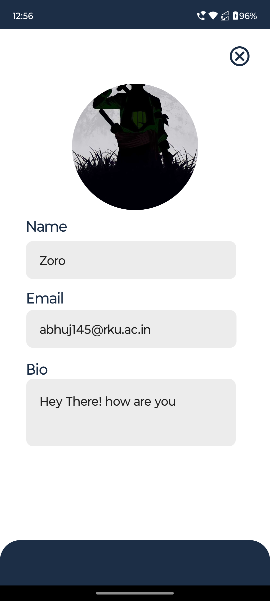

# 🏷️ Let’s Chat

A real-time chat application developed using **Android Studio** and **Firebase**. This application is written in **Java** and provides smooth real-time communication with a clean user interface.  

---

## 🛠 Tech Stack  
- **Java** (core programming language)  
- **Firebase** (database, authentication, and cloud messaging)  
- **Android Studio** (development platform)  

---

## 🚀 Features  
- ✅ User authentication (Sign Up & Login)  
- ✅ Real-time messaging between users  
- ✅ Push notifications for new messages  
- ✅ Clean and responsive UI optimized for multiple screen sizes  

---

## 📸 Screenshots  

### Splash Screen  

### Login Screen  

### Sign Up Screen  

### Home Screen  

### Chat Activity  

### Users Screen  

### Edit Profile  

### Profile Screen  

---

