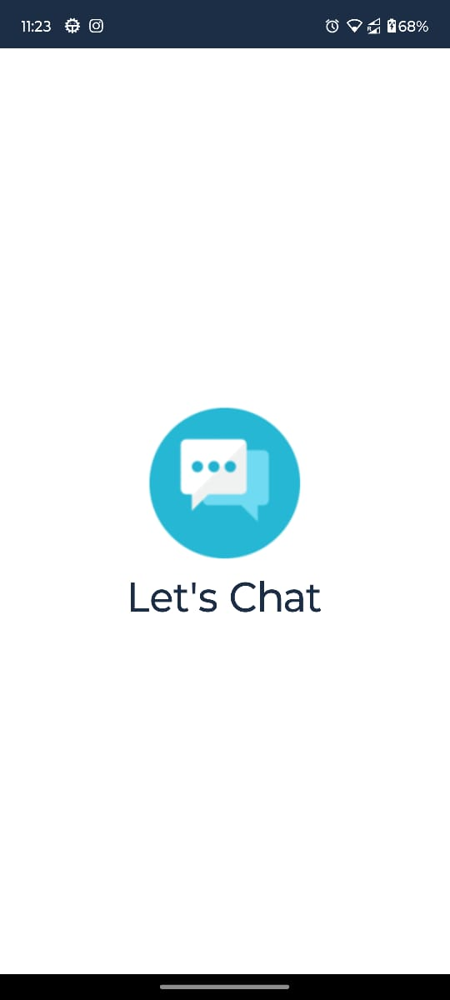
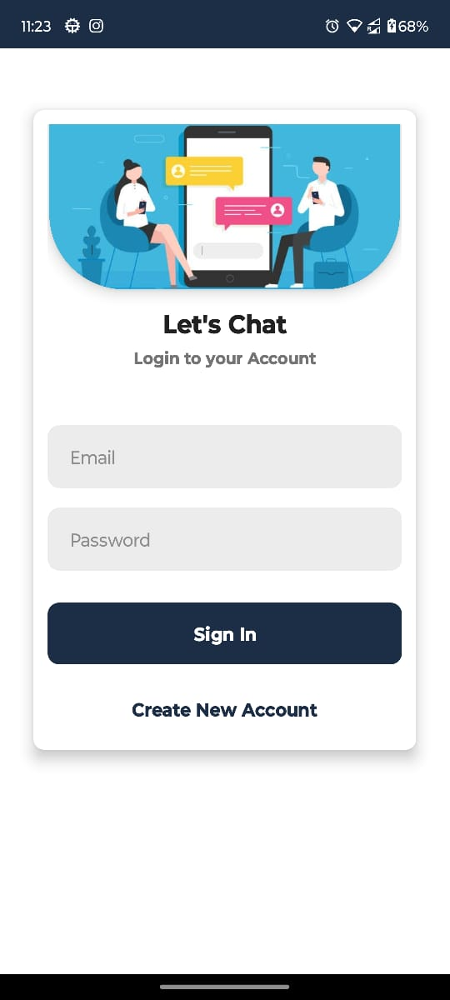
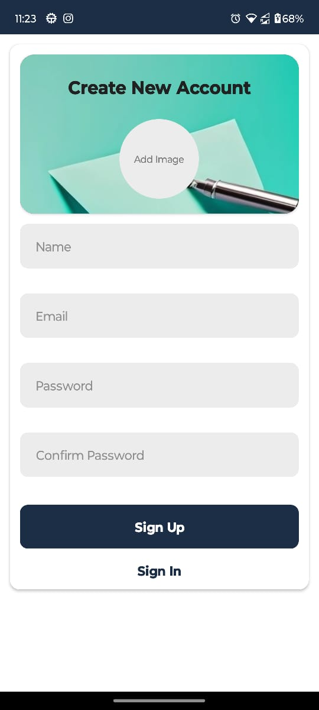
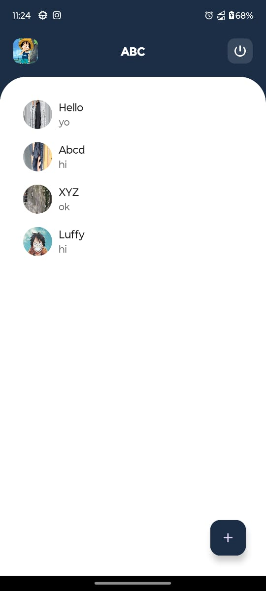
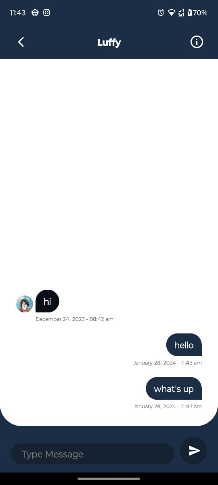

🏷 Lets Chat
A real-time chat application developed using Android Studio and FireBase. Java programming language is used in this application.

🛠 Tech stack used (Java, Firebase, Android Studio).

🚀 Features:

User authentication

Real-time messaging

Push notifications

Clean and responsive UI

📸 Screenshots section with images embedded like this:
## 📸 Screenshots

